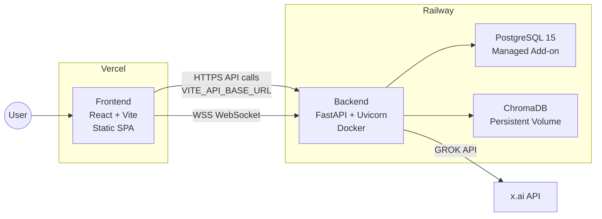
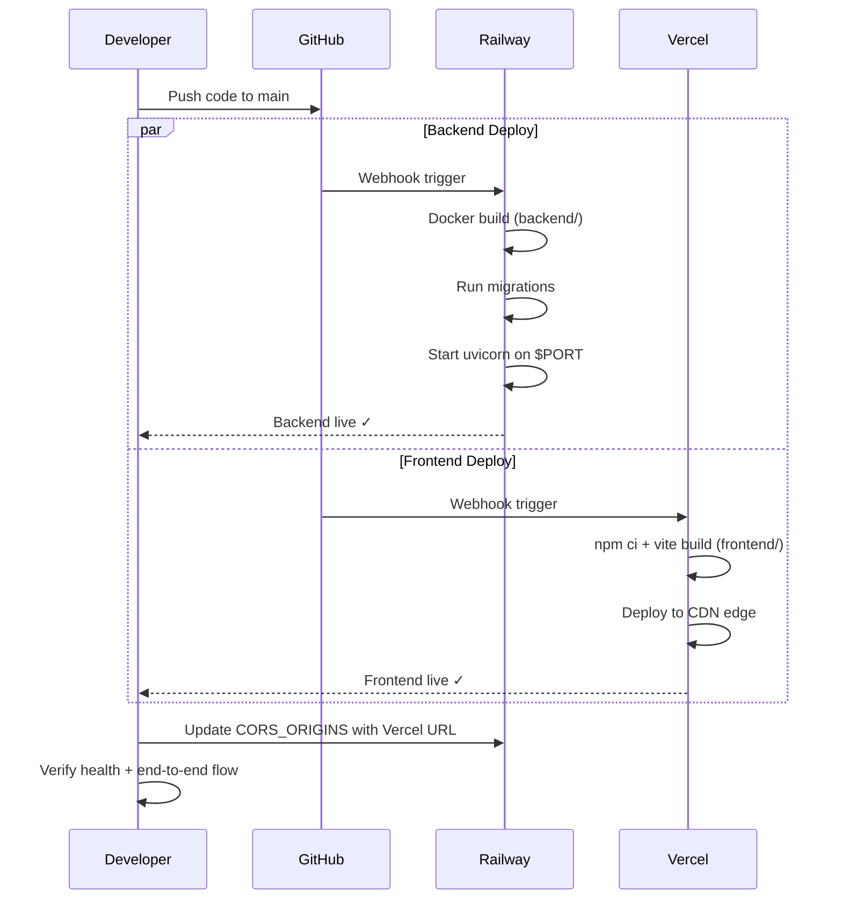

# Deployment Plan — RAG for GROW

> **Frontend → Vercel** · **Backend → Railway** · **Database → Railway PostgreSQL**

---

## Architecture Overview



---

## Prerequisites

| Item | Details |
|------|---------|
| **GitHub repo** | Push the monorepo to GitHub (Vercel & Railway both deploy from Git) |
| **Vercel account** | Free tier is sufficient — [vercel.com](https://vercel.com) |
| **Railway account** | Hobby plan ($5/mo) recommended for persistent volumes — [railway.com](https://railway.com) |
| **Domain (optional)** | Custom domain for frontend & backend |

---

## Phase 1 — Backend on Railway

### Step 1: Create a Railway Project

1. Go to [railway.com/dashboard](https://railway.com/dashboard) → **New Project**
2. Select **Deploy from GitHub Repo** → authorize & select `RAG_for_GROW`
3. Railway will auto-detect the Dockerfile

### Step 2: Configure Root Directory

Railway needs to know the backend lives in a subdirectory:

| Setting | Value |
|---------|-------|
| **Root Directory** | `backend` |
| **Builder** | `Dockerfile` (auto-detected from [`backend/Dockerfile`](file:///d:/GenAI/Practice/Pranju/RAG_for_GROW/backend/Dockerfile)) |

### Step 3: Add PostgreSQL

1. In your Railway project → **+ New** → **Database** → **PostgreSQL**
2. Railway provisions a managed PostgreSQL instance and exposes a `DATABASE_URL` variable automatically
3. **Link** the PostgreSQL service to the backend service

> [!IMPORTANT]
> Railway provides the `DATABASE_URL` in standard `postgresql://` format. Your app uses `postgresql+asyncpg://`. You must override it in the environment variables (see Step 4).

### Step 4: Set Environment Variables

In Railway → Backend service → **Variables** tab, add:

```env
# ─── Database (override Railway's auto-provided URL) ───────────────
DATABASE_URL=postgresql+asyncpg://<RAILWAY_PG_USER>:<RAILWAY_PG_PASSWORD>@<RAILWAY_PG_HOST>:<RAILWAY_PG_PORT>/<RAILWAY_PG_DB>

# ─── ChromaDB & Snapshots ──────────────────────────────────────────
CHROMA_PERSIST_DIR=/app/data/chromadb
SNAPSHOT_DIR=/app/data/snapshots

# ─── GROK LLM ──────────────────────────────────────────────────────
GROK_API_KEY=<your-grok-api-key>
GROK_API_BASE_URL=https://api.x.ai/v1
GROK_MODEL_NAME=grok-beta

# ─── Embedding Model ───────────────────────────────────────────────
EMBEDDING_MODEL=sentence-transformers/all-MiniLM-L6-v2

# ─── JWT Auth ───────────────────────────────────────────────────────
JWT_SECRET_KEY=<generate-a-64-char-hex-secret>
JWT_EXPIRY_HOURS=1

# ─── Scraping ──────────────────────────────────────────────────────
SCRAPE_INTERVAL_MINUTES=15
SCRAPE_TIMEOUT_SECONDS=30
SCRAPE_MAX_CONCURRENT=5

# ─── Admin Credentials ─────────────────────────────────────────────
ADMIN_DEFAULT_USERNAME=admin
ADMIN_DEFAULT_PASSWORD=<strong-production-password>

# ─── CORS (update after Vercel deploy) ─────────────────────────────
CORS_ORIGINS=https://<your-vercel-domain>.vercel.app

# ─── Port (Railway injects PORT automatically) ─────────────────────
PORT=8000
```

> [!WARNING]
> **Never commit your `.env` file.** Your [`.gitignore`](file:///d:/GenAI/Practice/Pranju/RAG_for_GROW/.gitignore) already excludes `.env` — verify this before pushing.

### Step 5: Update Dockerfile Start Command

Railway injects a `PORT` environment variable. Your current [`Dockerfile`](file:///d:/GenAI/Practice/Pranju/RAG_for_GROW/backend/Dockerfile) hardcodes port 8000. Update the `CMD` to respect Railway's dynamic port:

```diff
-CMD ["uvicorn", "app.main:app", "--host", "0.0.0.0", "--port", "8000"]
+CMD ["sh", "-c", "uvicorn app.main:app --host 0.0.0.0 --port ${PORT:-8000}"]
```

### Step 6: Handle Persistent Storage

> [!CAUTION]
> Railway's ephemeral filesystem means ChromaDB data and snapshots are lost on every redeploy. You have two options:

| Option | Pros | Cons |
|--------|------|------|
| **Railway Volume** (recommended) | Persistent across deploys | Requires Hobby plan ($5/mo); mount at `/app/data` |
| **External ChromaDB** | Fully managed, scalable | Adds latency; requires code changes |

**To add a Railway Volume:**
1. Backend service → **+ New** → **Volume**
2. Set mount path: `/app/data`
3. This persists both `chromadb/` and `snapshots/`

### Step 7: Handle Playwright on Railway

Your backend uses Playwright for scraping. The existing Dockerfile already installs Chromium and system dependencies — this will work on Railway's Docker builder.

> [!NOTE]
> Playwright + Chromium adds ~400MB to the Docker image. Railway's build may take 3-5 minutes on first deploy. Subsequent deploys use layer caching.

### Step 8: Deploy & Verify

1. Push to GitHub → Railway auto-deploys
2. Railway provides a public URL like `https://rag-for-grow-backend-production.up.railway.app`
3. Verify: `GET https://<railway-url>/health` should return:
   ```json
   {"status": "healthy", "database": "healthy", "timestamp": "..."}
   ```

### Step 9: Run Alembic Migrations

After the first deploy, run migrations via Railway's CLI or shell:

```bash
# Option A: Railway CLI
railway run alembic upgrade head

# Option B: Railway Shell (Dashboard → Backend → Shell tab)
alembic upgrade head
```

---

## Phase 2 — Frontend on Vercel

### Step 1: Import Project on Vercel

1. Go to [vercel.com/new](https://vercel.com/new)
2. Import the `RAG_for_GROW` GitHub repo
3. Configure the project:

| Setting | Value |
|---------|-------|
| **Framework Preset** | Vite |
| **Root Directory** | `frontend` |
| **Build Command** | `npm run build` (auto-detected) |
| **Output Directory** | `dist` (auto-detected) |
| **Install Command** | `npm ci` |

### Step 2: Set Environment Variables

In Vercel → Project Settings → **Environment Variables**:

```env
VITE_API_BASE_URL=https://<your-railway-backend-url>
VITE_WS_URL=wss://<your-railway-backend-url>
```

> [!IMPORTANT]
> Vite environment variables are **baked into the build at compile time** (they are not runtime). Every time you change these, you must **redeploy** the frontend.

### Step 3: Add SPA Rewrite Rule

Since this is a React SPA with `react-router-dom`, you need to redirect all routes to `index.html`. Create a [`vercel.json`](file:///d:/GenAI/Practice/Pranju/RAG_for_GROW/frontend/vercel.json) in the **frontend directory**:

```json
{
  "rewrites": [
    { "source": "/(.*)", "destination": "/index.html" }
  ]
}
```

### Step 4: Deploy & Verify

1. Push to GitHub → Vercel auto-deploys
2. Vercel provides a URL like `https://rag-for-grow.vercel.app`
3. Open the URL — the React app should load and connect to the Railway backend

---

## Phase 3 — Post-Deployment Configuration

### 3.1 Update CORS on Railway

Once you have the Vercel URL, update the `CORS_ORIGINS` variable on Railway:

```env
CORS_ORIGINS=https://rag-for-grow.vercel.app
```

If you also want to allow `www` or a custom domain:

```env
CORS_ORIGINS=https://rag-for-grow.vercel.app,https://www.yourdomain.com
```

### 3.2 Custom Domains (Optional)

| Platform | Steps |
|----------|-------|
| **Vercel** | Settings → Domains → Add domain → Update DNS (CNAME to `cname.vercel-dns.com`) |
| **Railway** | Backend service → Settings → Domains → Add custom domain → Update DNS |

### 3.3 WebSocket Configuration

Your frontend uses `VITE_WS_URL` for WebSocket connections. Railway supports WebSockets natively over HTTPS — just use the `wss://` protocol with the same Railway domain:

```env
VITE_WS_URL=wss://<your-railway-backend-url>
```

---

## Phase 4 — CI/CD Pipeline

Both Vercel and Railway auto-deploy on pushes to the main branch. For branch-specific behavior:

### Vercel
- **Production**: Deploys on push to `main`
- **Preview**: Auto-deploys on PRs (unique URL per PR)

### Railway
- **Production**: Deploys on push to `main`
- Configure in Settings → Deploys → **Watch Paths**: set to `backend/**` so frontend-only changes don't trigger backend rebuilds

---

## Files to Create / Modify

### [NEW] `frontend/vercel.json`

```json
{
  "rewrites": [
    { "source": "/(.*)", "destination": "/index.html" }
  ]
}
```

### [MODIFY] `backend/Dockerfile` — Dynamic port

```diff
-CMD ["uvicorn", "app.main:app", "--host", "0.0.0.0", "--port", "8000"]
+CMD ["sh", "-c", "uvicorn app.main:app --host 0.0.0.0 --port ${PORT:-8000}"]
```

### [NEW] `railway.toml` (optional, at repo root)

```toml
[build]
builder = "DOCKERFILE"
dockerfilePath = "backend/Dockerfile"

[deploy]
startCommand = "sh -c 'uvicorn app.main:app --host 0.0.0.0 --port ${PORT:-8000}'"
healthcheckPath = "/health"
healthcheckTimeout = 300
restartPolicyType = "ON_FAILURE"
restartPolicyMaxRetries = 3
```

---

## Security Checklist

- [ ] **Rotate all secrets** — generate fresh `JWT_SECRET_KEY`, `GROK_API_KEY`, and `ADMIN_DEFAULT_PASSWORD` for production
- [ ] **Remove hardcoded API key** from [`.env.example`](file:///d:/GenAI/Practice/Pranju/RAG_for_GROW/backend/.env.example) (line 13 currently contains a real key)
- [ ] **CORS** — restrict to only your Vercel production domain
- [ ] **HTTPS only** — both Vercel and Railway provide SSL by default
- [ ] **Rate limiting** — already configured via `slowapi` in [`main.py`](file:///d:/GenAI/Practice/Pranju/RAG_for_GROW/backend/app/main.py)

---

## Cost Estimate

| Service | Plan | Monthly Cost |
|---------|------|-------------|
| **Vercel** (Frontend) | Hobby (Free) | $0 |
| **Railway** (Backend + DB) | Hobby | ~$5 + usage |
| **Railway Volume** (1 GB) | Included in Hobby | $0 |
| **Total** | | **~$5/month** |

---

## Quick-Reference Commands

```bash
# ─── Generate a secure JWT secret ──────────────────────────
python -c "import secrets; print(secrets.token_hex(32))"

# ─── Railway CLI (install: npm i -g @railway/cli) ──────────
railway login
railway link                    # Link to your project
railway run alembic upgrade head  # Run migrations
railway logs                    # Tail backend logs

# ─── Vercel CLI (install: npm i -g vercel) ──────────────────
vercel login
vercel --prod                   # Manual production deploy
vercel env pull                 # Pull env vars locally
```

---

## Deployment Sequence Summary


