# Groww Market Intelligence — Phase-Wise Implementation Plan

> **Source Documents:**
> - [problemStatement.md](file:///d:/GenAI/Practice/Pranju/RAG_for_GROW/problemStatement.md) — Product requirements & mandatory rules
> - [architecture.md](file:///d:/GenAI/Practice/Pranju/RAG_for_GROW/architecture.md) — System architecture & technical design

---

## Implementation Overview

The project is broken into **7 phases**, each building on the previous one. Every phase produces a working, testable increment. Mandatory requirements (Admin, Scraping Failure Handling, Vector Sync, Grounding, Access Boundary) are woven into the earliest possible phase rather than deferred.

```
Phase 1 ─── Project Foundation & Backend Skeleton         ██░░░░░░░░░░░░  ~2 days
Phase 2 ─── Scraping Engine & Content Extraction          ████░░░░░░░░░░  ~3 days
Phase 3 ─── Vector DB, Embedding & Sync Engine            ██████░░░░░░░░  ~3 days
Phase 4 ─── RAG Query Pipeline & Grounded Chat            ████████░░░░░░  ~3 days
Phase 5 ─── Admin Subsystem (Auth, URL Mgmt, Status)      ██████████░░░░  ~2 days
Phase 6 ─── Frontend — Chat UI & Admin Panel              ████████████░░  ~4 days
Phase 7 ─── Advanced Features & Polish                    ██████████████  ~4 days
                                                          ─────────────
                                                          Total: ~21 days
```

---

## Phase 1: Project Foundation & Backend Skeleton

**Goal:** Set up the project structure, dev environment, database, configuration management, and a runnable FastAPI server with health-check endpoints.

### 1.1 Project Scaffolding

| Task | Details |
|---|---|
| Create directory structure | Follow the [directory structure](file:///d:/GenAI/Practice/Pranju/RAG_for_GROW/architecture.md) from §17 of architecture |
| Initialize Python backend | `backend/` with `requirements.txt`, virtual environment |
| Initialize React frontend | `frontend/` with Vite + React 18 scaffold |
| Create `docker-compose.yml` | Services: `backend`, `frontend`, `postgres` |
| Create `.env.example` | All environment variables from architecture §15.2 |
| Create `.gitignore` | Python, Node, data dirs, `.env`, `chromadb/`, `snapshots/` |

**Files to create:**
```
backend/
├── app/__init__.py
├── app/main.py               # FastAPI app factory with lifespan
├── app/config.py              # Pydantic Settings from env vars
├── requirements.txt
├── Dockerfile
├── .env.example
frontend/
├── (Vite scaffold)
docker-compose.yml
.gitignore
README.md
```

### 1.2 Backend Configuration

```python
# backend/app/config.py — Key settings to define
class Settings(BaseSettings):
    DATABASE_URL: str
    CHROMA_PERSIST_DIR: str = "./data/chromadb"
    SNAPSHOT_DIR: str = "./data/snapshots"
    GROK_API_KEY: str
    EMBEDDING_MODEL: str = "sentence-transformers/all-MiniLM-L6-v2"
    JWT_SECRET_KEY: str
    JWT_EXPIRY_HOURS: int = 1
    SCRAPE_INTERVAL_MINUTES: int = 15
    SCRAPE_TIMEOUT_SECONDS: int = 30
    SCRAPE_MAX_CONCURRENT: int = 5
    ADMIN_DEFAULT_USERNAME: str = "admin"
    ADMIN_DEFAULT_PASSWORD: str = "admin"
    CORS_ORIGINS: str = "http://localhost:3000"
```

### 1.3 Database Setup

| Task | Details |
|---|---|
| Define SQLAlchemy ORM models | All 9 tables from architecture §5.1 |
| Create `session.py` | Async SQLAlchemy session factory |
| Create `init_db.py` | Auto-create tables + seed admin user (admin/admin) |
| Set up Alembic | Migration infrastructure for future schema changes |

**Tables to create (from architecture §5.1):**
- `admin_users` — seed with bcrypt hash of "admin"
- `source_urls` — seed with all 33 mandatory URLs from problemStatement §3
- `refresh_status` — one row per source URL, initial status = `pending`
- `scrape_history` — empty, populated by scraper
- `nfo_tracking` — empty
- `news_tracking` — empty
- `watchlist_items` — empty
- `notification_prefs` — empty
- `system_state` — seed with `last_global_refresh_at`, `refresh_in_progress=false`

### 1.4 FastAPI Application Shell

```python
# backend/app/main.py — Startup structure
app = FastAPI(title="Groww Market Intelligence RAG")

# Lifespan: init DB, seed admin, start scheduler
@asynccontextmanager
async def lifespan(app):
    await init_database()
    await seed_admin_user()
    await seed_initial_urls()
    yield

# Route groups
app.include_router(chat_router,  prefix="/api/chat",  tags=["Chat"])
app.include_router(data_router,  prefix="/api/data",  tags=["Data"])
app.include_router(admin_router, prefix="/api/admin", tags=["Admin"])

# CORS middleware
# Health check endpoint: GET /health
```

### 1.5 Pydantic Schemas

Define request/response models in `backend/app/models/schemas.py`:
- `SourceURLCreate`, `SourceURLResponse`
- `RefreshStatusResponse`
- `ScrapeHistoryResponse`
- `AdminLoginRequest`, `AdminLoginResponse`
- `ChatMessage`, `ChatResponse`, `SourceCitation`
- `ComparisonRequest`, `ComparisonResponse`
- `WatchlistItem`, `NotificationPrefs`

### 1.6 Phase 1 Verification

- [ ] `docker-compose up` starts PostgreSQL + backend successfully
- [ ] `GET /health` returns `200 OK`
- [ ] Database tables are created on startup
- [ ] Admin user `admin/admin` exists in `admin_users` table
- [ ] 33 mandatory URLs exist in `source_urls` table
- [ ] `refresh_status` has one row per source URL

---

## Phase 2: Scraping Engine & Content Extraction

**Goal:** Build the Playwright-based scraper with page-type-specific extractors that can successfully scrape all 33 mandatory Groww URLs and extract structured data.

### 2.1 Scraper Engine Core

| Task | Details |
|---|---|
| Install Playwright + Chromium | `playwright install chromium` in Dockerfile |
| Build `ResilientScraper` class | Retry logic (2 retries, 5s delay), 30s timeout per page |
| Build browser context pool | Max 5 concurrent contexts to limit resource usage |
| Build URL type router | Route URLs to correct extractor based on `source_type` |

**File:** `backend/app/scraper/engine.py`

```python
# Key class structure
class ScraperEngine:
    async def initialize()          # Launch Playwright browser
    async def scrape(url, type)     # Route to correct extractor
    async def shutdown()            # Close browser

class ResilientScraper:
    MAX_RETRIES = 2
    RETRY_DELAY = 5
    TIMEOUT = 30_000
    async def scrape_with_retry(url) -> ScrapedContent
```

### 2.2 Page-Type Extractors

Build 5 extractors, one per source type. Each extracts structured fields from rendered HTML using BeautifulSoup4 selectors.

#### 2.2.1 Mutual Fund Extractor
**File:** `backend/app/scraper/extractors/mutual_fund.py`

Fields to extract (from architecture §7.2):
```
fund_name, nav, nav_date, returns_1y, returns_3y, returns_5y,
returns_7y, returns_10y, expense_ratio, exit_load, risk_level,
fund_size_aum, rating, fund_manager, category, sub_category,
amc, benchmark, scheme_type, plan, investment_objective,
top_holdings[], sector_allocation[], asset_allocation{}
```

**Test against:** All 29 individual mutual fund URLs from problemStatement §3.

#### 2.2.2 AMC Page Extractor
**File:** `backend/app/scraper/extractors/amc.py`

Extract: AMC name, description, total funds, AUM, fund list, and other factual content present on the page.

**Test against:** `https://groww.in/mutual-funds/amc/aditya-birla-sun-life-mutual-funds`

#### 2.2.3 NFO Page Extractor
**File:** `backend/app/scraper/extractors/nfo.py`

Fields: `nfo_name, amc, category, sub_category, subscription_status, open_date, close_date, scheme_type, min_investment, benchmark`

**Test against:** `https://groww.in/nfo`

#### 2.2.4 Market News Extractor
**File:** `backend/app/scraper/extractors/market_news.py`

Fields: `title, summary, published_at, updated_at, category, tags, article_url`

**Test against:** `https://groww.in/share-market-today`

#### 2.2.5 Filter Page Extractor
**File:** `backend/app/scraper/extractors/filter_page.py`

Extract: List of fund names, NAVs, returns, and other summary data from the filter/listing view.

**Test against:** The filter URL from problemStatement §3 (fund house filter).

### 2.3 Data Normalizer & Validator

**File:** `backend/app/scraper/normalizer.py`
- Strip whitespace, normalize currency symbols (₹)
- Parse percentage strings to consistent format
- Parse dates to ISO 8601
- Handle "N/A", "-", empty fields gracefully

**File:** `backend/app/scraper/validator.py`
- Validate mandatory fields are present (fund_name for MF, title for news)
- Log warnings for missing optional fields
- Reject completely empty extractions

### 2.4 Content Hashing

**File:** `backend/app/pipeline/change_detector.py`
- `compute_content_hash(extracted_data) -> SHA-256 hex string`
- Deterministic: sorted keys, consistent serialization
- Used in Phase 3 for change detection

### 2.5 Phase 2 Verification

- [ ] Scraper can launch Playwright headless Chromium
- [ ] Each of the 33 URLs can be scraped without timeout
- [ ] Mutual fund extractor returns all expected fields for HDFC Mid Cap Fund
- [ ] NFO extractor returns a list of current NFOs
- [ ] Market news extractor returns recent article titles and summaries
- [ ] AMC extractor returns fund house information
- [ ] Normalizer handles ₹, %, date formats correctly
- [ ] Content hash is deterministic (same input → same hash)
- [ ] Failed scrapes raise `ScrapeFailedError` (not crash)

**Standalone test script:** Run scraper against 5 sample URLs, print extracted JSON.

---

## Phase 3: Vector DB, Embedding & Synchronization Engine

**Goal:** Build the ChromaDB vector store, embedding pipeline, snapshot management, and the **mandatory 5-state synchronization engine** that handles UNCHANGED / CHANGED / NEW / DELETED / FAILED sources correctly.

### 3.1 ChromaDB Setup

| Task | Details |
|---|---|
| Initialize ChromaDB client | Persistent mode at `CHROMA_PERSIST_DIR` |
| Create collection | `groww_funds` with cosine similarity |
| Define metadata schema | As specified in architecture §5.2 |

**File:** `backend/app/pipeline/embedder.py`

### 3.2 Embedding Pipeline

| Task | Details |
|---|---|
| Load embedding model | `sentence-transformers/all-MiniLM-L6-v2` (384-dim) |
| Build `embed_chunks()` | Batch encode text chunks → float32 vectors |
| Integrate with ChromaDB | `chromadb.add()` with ids, documents, embeddings, metadatas |

### 3.3 Content Chunking

**File:** `backend/app/pipeline/chunker.py`

Implement 4 chunking strategies (from architecture §7.4):

| Source Type | Strategy | Max Chunk Size | Overlap |
|---|---|---|---|
| `mutual_fund` | Single-Document Textification | None (Single Chunk) | 0 |
| `amc` | Recursive text splitter | 800 tokens | 100 |
| `nfo` | Per-NFO item (one chunk per NFO) | 500 tokens | 0 |
| `market_news` | Per-article (one chunk per news item) | 600 tokens | 0 |

### 3.4 Snapshot Manager

**File:** `backend/app/pipeline/snapshot_manager.py`

```python
class SnapshotManager:
    def save_current(url, extracted_data)     # → snapshots/{hash}/current.json
    def rotate(url)                           # current.json → previous.json
    def compute_diff(url)                     # Compare current vs previous → diff.json
    def get_diff(url) -> dict                 # Read diff.json
    def delete_snapshots(url)                 # Remove all snapshots for URL
```

Snapshot JSON format follows architecture §5.3.

### 3.5 Synchronization Engine — MANDATORY

**File:** `backend/app/pipeline/sync_engine.py`

This is the **core mandatory logic** from architecture §8 and problemStatement §C.

```python
class SyncEngine:
    """
    Implements the 5-state synchronization decision matrix.
    Called by: 15-minute scheduler AND admin manual trigger.
    """

    async def run_sync_cycle(trigger_type: str):
        # 1. Get configured URLs from DB
        # 2. Detect DELETED sources → remove vectors
        # 3. For each active URL:
        #    a. Attempt scrape
        #    b. On failure → FAILED path (retain vectors, log error)
        #    c. On success → compute hash
        #    d. Hash unchanged → UNCHANGED path (skip)
        #    e. Hash changed or new → CHANGED/NEW path (re-embed)
        # 4. Update all metadata in PostgreSQL
```

**Decision matrix (MUST implement exactly):**

| State | Vector Action | DB Action | Snapshot Action |
|---|---|---|---|
| **UNCHANGED** | Keep existing | `last_attempt_at=now`, `status=unchanged` | No change |
| **CHANGED** | Delete old → embed new → insert | `last_attempt_at=now`, `last_success_at=now`, `status=success`, update `content_hash` | Rotate current→previous, save new current, compute diff |
| **NEW** | Embed → insert | Create `refresh_status` row, `status=success` | Create initial current.json |
| **DELETED** | Delete all vectors for source | `is_active=false`, `removed_at=now` | Delete snapshot dir |
| **FAILED** | **DO NOT DELETE** existing vectors | `last_attempt_at=now`, `status=failed`, increment `error_count`, set `error_message`. **DO NOT update** `last_success_at` | No change |

### 3.6 Scheduler Setup

**File:** `backend/app/pipeline/scheduler.py`

```python
# APScheduler configuration
scheduler = AsyncIOScheduler()

def start_scheduler():
    scheduler.add_job(
        sync_engine.run_sync_cycle,
        trigger=IntervalTrigger(minutes=settings.SCRAPE_INTERVAL_MINUTES),
        kwargs={"trigger_type": "scheduler"},
        id="auto_refresh",
        replace_existing=True,
    )
    scheduler.start()

async def trigger_manual_sync():
    """Called by admin API to run immediate sync."""
    await sync_engine.run_sync_cycle(trigger_type="admin_manual")
```

Integrate into FastAPI lifespan: start scheduler on startup, shut down on exit.

### 3.7 Initial Data Load

On first startup (or when `refresh_status` is all `pending`):
1. Run a full sync cycle for all 33 URLs
2. This performs the NEW path for each → scrape, extract, chunk, embed, insert
3. Takes ~5-10 minutes depending on network
4. Log progress to console

### 3.8 Phase 3 Verification

- [ ] ChromaDB collection is created and persists across restarts
- [ ] Embedding model loads successfully and produces 384-dim vectors
- [ ] Chunker produces correct chunk counts for each source type
- [ ] **UNCHANGED test:** Run sync twice with no page changes → second run skips all sources
- [ ] **CHANGED test:** Modify a snapshot manually → sync detects change and re-embeds
- [ ] **NEW test:** Add a new URL to `source_urls` → sync scrapes and embeds it
- [ ] **DELETED test:** Remove a URL from `source_urls` → sync deletes its vectors
- [ ] **FAILED test:** Point a URL at an invalid address → sync retains old vectors, logs error
- [ ] `scrape_history` table has correct records for each sync cycle
- [ ] `refresh_status` shows correct `last_attempt_at` vs `last_success_at` for failed sources
- [ ] Scheduler fires every 15 minutes automatically
- [ ] Snapshot files (current.json, previous.json, diff.json) are created correctly

---

## Phase 4: RAG Query Pipeline & Grounded Chat

**Goal:** Build the complete RAG pipeline — query classification, retrieval from ChromaDB, grounded prompt construction, LLM generation via GROK LLM, post-generation guardrails, and the WebSocket chat endpoint.

### 4.1 Query Classifier

**File:** `backend/app/rag/query_classifier.py`

Classify user queries into one of 10 types (from architecture §9.1):

```python
QUERY_TYPES = [
    "fund_lookup",       # "What is the NAV of HDFC Mid Cap Fund?"
    "fund_comparison",   # "Compare HDFC Small Cap and Nippon India Small Cap"
    "nfo_query",         # "What new NFOs are available?"
    "news_query",        # "What are the latest market news?"
    "category_search",   # "Which funds are in the pharma category?"
    "metric_search",     # "Which fund has the lowest expense ratio?"
    "freshness_query",   # "When was this data last updated?"
    "change_query",      # "What changed since last refresh?"
    "advice_request",    # "Should I buy HDFC Mid Cap Fund?"
    "general",           # Anything else
]
```

**Implementation approach:** Use a lightweight GROK LLM call with a classification prompt, or rule-based keyword matching for common patterns. GROK LLM classification is preferred for natural language robustness.

### 4.2 Grounded Retriever

**File:** `backend/app/rag/retriever.py`

```python
class GroundedRetriever:
    async def retrieve(query, query_type, filters) -> list[Document]:
        # 1. Build ChromaDB where clause from query_type + filters
        # 2. Run similarity search (n_results=10)
        # 3. For comparisons: ensure coverage of all requested funds
        # 4. Attach source metadata to each result
        # 5. Return ranked documents with metadata
```

**Retrieval strategies by query type:**

| Query Type | ChromaDB Filter | n_results |
|---|---|---|
| `fund_lookup` | `source_type=mutual_fund`, `fund_name` contains query entity | 5 |
| `fund_comparison` | `source_type=mutual_fund`, run multiple queries per fund | 5 per fund |
| `nfo_query` | `source_type=nfo` | 10 |
| `news_query` | `source_type=market_news` | 10 |
| `category_search` | `source_type=mutual_fund` (broad, filter post-retrieval) | 15 |
| `metric_search` | `source_type=mutual_fund` (broad, rank post-retrieval) | 20 |
| `freshness_query` | Query PostgreSQL `refresh_status` instead of ChromaDB | N/A |
| `change_query` | Read `diff.json` snapshots from disk | N/A |

### 4.3 Prompt Templates

**File:** `backend/app/rag/prompt_templates.py`

Define the system prompt with **strict grounding rules** (from architecture §9.3):

```
SYSTEM PROMPT RULES:
1. Answer ONLY from provided source context
2. Fallback: "Currently I dont have the data to answer the query"
3. NEVER provide investment advice
4. For comparisons: side-by-side facts only, no winners
5. Always cite source type + refresh time
6. Show "N/A" for missing fields
7. Do NOT infer or calculate values not in context
```

Create prompt variants for:
- `fund_lookup_prompt` — single fund info with source citation
- `comparison_prompt` — multi-fund table format
- `nfo_prompt` — NFO list/status format
- `news_prompt` — news summary format
- `change_prompt` — diff summary format
- `advice_decline_prompt` — polite refusal template

### 4.4 Grounded Generator

**File:** `backend/app/rag/generator.py`

```python
class GroundedGenerator:
    def __init__(self):
        self.model = get_grok_model()

    async def generate(self, query, context_docs, chat_history, query_type):
        # 1. Select prompt template based on query_type
        # 2. Format context from retrieved documents
        # 3. Include source metadata (URLs, timestamps)
        # 4. Include chat history for follow-up resolution
        # 5. Call GROK LLM with system prompt + formatted prompt
        # 6. Return raw response for guardrail check
```

### 4.5 Grounding Guardrail

**File:** `backend/app/rag/guardrail.py`

Post-generation filter (from architecture §9.4):

```python
class GroundingGuardrail:
    def validate(response, context) -> (is_valid, filtered_response):
        # 1. Check for investment advice patterns (regex)
        # 2. Check numeric claims appear in context
        # 3. If invalid → return fallback message or advice decline
        # 4. If valid → return response as-is
```

**Advice patterns to block:**
- "you should buy/sell/invest/avoid"
- "I recommend/suggest/advise"
- "guaranteed to"
- "will go up/increase/decrease/crash"
- "best time/opportunity to"
- "buy now/sell now/wait"

### 4.6 Conversation Memory

**File:** `backend/app/rag/conversation.py`

```python
class ConversationManager:
    # Per-session memory using LangChain ConversationBufferWindowMemory
    # Keep last 10 exchanges
    # Used for follow-up resolution ("this fund", "the second one")
```

### 4.7 WebSocket Chat Endpoint

**File:** `backend/app/api/chat.py`

```python
@router.websocket("/ws")
async def chat_websocket(websocket, session_id: str):
    # 1. Accept connection
    # 2. Loop: receive user message
    # 3. Classify query
    # 4. If advice_request → return decline immediately
    # 5. Retrieve context from ChromaDB
    # 6. Generate response with GROK LLM
    # 7. Run guardrail check
    # 8. Stream response chunks to client
    # 9. Send final message with source citations
    # 10. Store in conversation memory
```

**Message format (from architecture §6.1):**
- Client → Server: `{ type, content, conversation_id }`
- Server → Client (streaming): `{ type: "assistant_chunk", content, done: false }`
- Server → Client (final): `{ type: "assistant_message", content, sources[], done: true }`

### 4.8 Public Data Endpoints

**File:** `backend/app/api/data.py`

Implement the REST endpoints from architecture §6.2:

| Priority | Endpoint | Description |
|---|---|---|
| P0 | `GET /api/data/funds` | List all funds with basic metadata |
| P0 | `GET /api/data/funds/{slug}` | Single fund detail |
| P0 | `GET /api/data/freshness` | Global + per-source freshness |
| P1 | `POST /api/data/compare` | Multi-fund comparison |
| P1 | `GET /api/data/nfo` | All NFOs |
| P1 | `GET /api/data/news` | All news |
| P2 | `GET /api/data/changes` | Changes since last refresh |
| P2 | `GET /api/data/nfo/new` | Newly detected NFOs |
| P2 | `GET /api/data/news/new` | Newly detected news |

### 4.9 Phase 4 Verification

- [ ] Query classifier correctly identifies all 10 query types
- [ ] Retriever returns relevant documents for "What is the NAV of HDFC Mid Cap Fund?"
- [ ] Generator produces grounded answers with source citations
- [ ] Guardrail blocks "Should I buy HDFC Mid Cap Fund?" → advice decline
- [ ] Guardrail passes "What is the expense ratio of HDFC Mid Cap Fund?" → factual answer
- [ ] Missing data triggers exact fallback: "Currently I dont have the data to answer the query"
- [ ] WebSocket chat endpoint accepts connection and returns streamed response
- [ ] Follow-up "What about its returns?" resolves to the previously discussed fund
- [ ] Comparison query produces side-by-side table without recommendations
- [ ] `GET /api/data/freshness` returns correct per-source status
- [ ] `GET /api/data/funds` returns list of all scraped funds

---

## Phase 5: Admin Subsystem

**Goal:** Build the complete admin authentication, URL management, manual sync trigger, and operational status visibility — all **mandatory requirements** from problemStatement §A and §E.

### 5.1 Authentication

**File:** `backend/app/auth/jwt_handler.py`

```python
class JWTHandler:
    def create_token(user_id, username) -> str    # PyJWT, HS256, 1-hour expiry
    def verify_token(token) -> dict               # Decode + validate expiry
```

**File:** `backend/app/auth/password.py`

```python
def hash_password(plain) -> str      # bcrypt
def verify_password(plain, hashed) -> bool
```

**File:** `backend/app/api/deps.py`

```python
async def verify_jwt(authorization: str = Header()):
    # Extract Bearer token
    # Verify with JWTHandler
    # Raise 401 if invalid/expired
    # Return admin user info
```

### 5.2 Admin API Endpoints

**File:** `backend/app/api/admin.py`

All endpoints protected by `Depends(verify_jwt)`:

| Endpoint | Implementation Notes |
|---|---|
| `POST /api/admin/login` | Verify bcrypt hash → return JWT |
| `GET /api/admin/urls` | `SELECT * FROM source_urls WHERE is_active = true` |
| `POST /api/admin/urls` | Validate groww.in domain, insert, return 201 |
| `DELETE /api/admin/urls/{id}` | Soft delete (`is_active=false`, `removed_at=now`) |
| `PUT /api/admin/urls/{id}` | Update URL or source_type |
| `POST /api/admin/sync` | Call `trigger_manual_sync()`, return results |
| `GET /api/admin/status` | Aggregate from `refresh_status` table |
| `GET /api/admin/status/{id}` | Single source detail |
| `GET /api/admin/history` | Paginated `scrape_history` with filters |
| `GET /api/admin/errors` | Recent failures from `scrape_history` |

### 5.3 Admin Sync Trigger Flow

When admin calls `POST /api/admin/sync`:

1. Read current `source_urls` (the authoritative set)
2. Run full `sync_engine.run_sync_cycle(trigger_type="admin_manual")`
3. This automatically handles:
   - **Deleted URLs** → vectors removed from ChromaDB
   - **New URLs** → scraped, embedded, inserted
   - **Changed URLs** → re-embedded
   - **Unchanged URLs** → skipped
   - **Failed URLs** → retained with error logged
4. Return summary: `{ total, success, failed, unchanged, new, deleted }`

### 5.4 URL Validation Rules

```python
def validate_scraping_url(url: str) -> bool:
    # Must be valid URL format
    # Must be from groww.in domain
    # Must not be a duplicate of an existing active URL
    # Must match one of: /mutual-funds/*, /nfo, /share-market-today, /mutual-funds/filter*, /mutual-funds/amc/*
```

### 5.5 Phase 5 Verification

- [ ] `POST /api/admin/login` with admin/admin returns valid JWT
- [ ] `POST /api/admin/login` with wrong password returns 401
- [ ] `GET /api/admin/urls` without JWT returns 401
- [ ] `GET /api/admin/urls` with valid JWT returns URL list
- [ ] `POST /api/admin/urls` adds a new URL, visible in list
- [ ] `DELETE /api/admin/urls/{id}` soft-deletes, no longer in active list
- [ ] `POST /api/admin/sync` triggers full sync cycle
- [ ] After sync: deleted URL's vectors are removed from ChromaDB
- [ ] After sync: new URL is scraped and embedded
- [ ] `GET /api/admin/status` shows overall + per-source status
- [ ] `GET /api/admin/errors` shows recent failures with error messages
- [ ] Admin endpoints are NOT accessible from public `/api/data/` or `/api/chat/` routes
- [ ] Normal users never see admin controls

---

## Phase 6: Frontend — Chat UI & Admin Panel

**Goal:** Build the complete React frontend with the chat interface (public, no login), admin panel (JWT-protected), and core UI components that make the source-grounding promise visible.

### 6.1 Frontend Scaffolding

| Task | Details |
|---|---|
| Initialize Vite + React 18 | `npx -y create-vite@latest ./ --template react` |
| Install dependencies | `axios`, `react-router-dom`, `recharts` |
| Set up CSS design system | `index.css` with CSS variables, color tokens, typography |
| Set up React Router | Routes from architecture §13.1 |
| Create API service layer | Axios instance with base URL + JWT interceptor |

### 6.2 Design System & Global Components

**File:** `frontend/src/index.css`

```css
:root {
    /* Color tokens — dark financial theme */
    --color-bg-primary: #0f1117;
    --color-bg-secondary: #1a1d28;
    --color-bg-card: #242836;
    --color-accent: #00d09c;          /* Groww green */
    --color-accent-hover: #00b386;
    --color-text-primary: #e8e8e8;
    --color-text-secondary: #8b8fa3;
    --color-danger: #ef4444;
    --color-warning: #f59e0b;
    --color-success: #22c55e;

    /* Freshness status colors */
    --freshness-healthy: #22c55e;
    --freshness-stale: #f59e0b;
    --freshness-failed: #ef4444;
    --freshness-unavailable: #6b7280;
}
```

**Global components to build:**

| Component | Purpose |
|---|---|
| `SourceOnlyBanner` | Persistent top banner: "🔒 Groww Source-Only Mode" |
| `FreshnessIndicator` | Global bar showing data health (green/amber/red/grey) |
| `Navigation` | Tab bar: Chat \| Compare \| NFO \| News \| Watchlist \| (Admin) |
| `LoadingSpinner` | Animated loading indicator |

### 6.3 Chat Interface (Public — No Login)

**Route:** `/` (default landing page)

| Component | Details |
|---|---|
| `ChatPage` | Page container with message list + input |
| `ChatWindow` | Scrollable message list |
| `ChatMessage` | Renders user or assistant message bubbles |
| `ChatInput` | Text input + send button, handles Enter key |
| `SourceCitation` | Shows source URL, type badge, refresh timestamp |
| `ComparisonTable` | Inline table for comparison responses |

**WebSocket integration:**
```javascript
// frontend/src/hooks/useWebSocket.js
function useWebSocket(sessionId) {
    // Connect to ws://localhost:8000/api/chat/ws?session_id=...
    // Handle streaming chunks → append to current message
    // Handle final message → display source citations
    // Auto-reconnect on disconnect
}
```

**Session management:**
- Generate random UUID on first visit, store in `localStorage`
- Pass as `session_id` to WebSocket and data API calls
- No login required for normal users

### 6.4 Admin Panel (JWT-Protected)

**Route:** `/admin/login` and `/admin/dashboard`

| Component | Details |
|---|---|
| `AdminLoginPage` | Username/password form → `POST /api/admin/login` |
| `AdminDashboardPage` | Protected route (redirect to login if no JWT) |
| `URLManager` | Table of URLs with Add/Delete buttons |
| `SyncButton` | "Trigger Sync" button → `POST /api/admin/sync` |
| `RefreshStatusPanel` | Overall status + per-source status table |
| `AuthContext` | React Context for JWT storage + auth state |

**Auth flow:**
1. Admin navigates to `/admin/login`
2. Submits credentials → receives JWT
3. Store JWT in React state (not localStorage for security)
4. Redirect to `/admin/dashboard`
5. All admin API calls include `Authorization: Bearer {jwt}` header
6. On 401 response → redirect back to login

### 6.5 Comparison Page

**Route:** `/compare`

| Component | Details |
|---|---|
| `ComparePage` | Page with fund selector + comparison grid |
| `FundSelector` | Multi-select dropdown from `GET /api/data/funds` |
| `ComparisonGrid` | Side-by-side table: NAV, returns, expense ratio, risk, etc. |

- Missing values display "N/A" (never guessed)
- No ranking or recommendation in the UI
- Uses `POST /api/data/compare` endpoint

### 6.6 Phase 6 Verification

- [ ] Landing page (`/`) shows chat interface with "Groww Source-Only Mode" banner
- [ ] Chat sends message via WebSocket, receives streamed response
- [ ] Source citations appear below each assistant message
- [ ] Freshness indicator shows correct color based on refresh status
- [ ] `/admin/login` shows login form
- [ ] Correct credentials → redirect to `/admin/dashboard`
- [ ] Wrong credentials → error message, no redirect
- [ ] Admin dashboard shows URL list with Add/Delete functionality
- [ ] Sync button triggers refresh and shows progress/results
- [ ] Per-source status table shows status, timestamps, errors
- [ ] `/compare` allows multi-fund selection and shows side-by-side table
- [ ] Admin routes are not accessible without JWT
- [ ] UI is responsive, dark-themed, and visually polished

---

## Phase 7: Advanced Features & Polish

**Goal:** Implement remaining features (NFO tracking, news feed, watchlist, notifications, change-awareness), polish the UI, add comprehensive error handling, and prepare for deployment.

### 7.1 NFO Discovery & Tracking

**Files:**
- `backend/app/pipeline/nfo_tracker.py`
- `frontend/src/pages/NFOPage.jsx`
- `frontend/src/components/nfo/NFOCard.jsx`
- `frontend/src/components/nfo/NFOList.jsx`

| Task | Details |
|---|---|
| NFO change detection | Compare current vs previous NFO scrape → detect new/changed/removed |
| `nfo_tracking` table updates | `first_seen_at`, `last_seen_at`, `is_new`, `content_hash` |
| NFO page UI | Card grid with status badges (Open/Closed/Upcoming), "NEW" tag |
| NFO chatbot queries | "What new NFOs are available?" → retrieves from NFO-type vectors |
| Notification toggle | User can opt in to NFO notifications |

### 7.2 Market News Feed

**Files:**
- `backend/app/pipeline/news_tracker.py`
- `frontend/src/pages/NewsPage.jsx`
- `frontend/src/components/news/NewsCard.jsx`
- `frontend/src/components/news/NewsList.jsx`

| Task | Details |
|---|---|
| News change detection | Compare current vs previous news scrape → detect new articles |
| `news_tracking` table updates | `first_seen_at`, `last_seen_at`, `is_new`, `content_hash` |
| News page UI | Article cards with title, time, summary, "NEW" tag |
| News search | Filter by keyword/topic within collected content |
| News chatbot queries | "What are the latest market news?" → retrieves from news vectors |

### 7.3 Change Awareness ("What changed?")

**Files:**
- `backend/app/api/data.py` (add change endpoints)
- `frontend/src/components/watchlist/ChangesSummary.jsx`

| Task | Details |
|---|---|
| `GET /api/data/changes` | Read diff.json snapshots → return field-level changes |
| Change chatbot queries | "What changed in HDFC Mid Cap since last update?" |
| Change diff retriever | `rag/retriever.py` reads snapshot diffs for change_query type |
| UI change indicators | Show changed fields with old→new values |

### 7.4 User Watchlist

**Files:**
- `frontend/src/pages/WatchlistPage.jsx`
- `frontend/src/components/watchlist/WatchlistPanel.jsx`

| Task | Details |
|---|---|
| `POST /api/data/watchlist` | Save fund/topic to watchlist (keyed by session_id) |
| `GET /api/data/watchlist` | Retrieve user's saved items |
| `DELETE /api/data/watchlist/{id}` | Remove item |
| Watchlist page UI | List of saved items with latest info + detected changes |
| Consolidated view | For each watched item: latest data, changes, related news/NFOs |

### 7.5 Notification System

**Files:**
- `backend/app/notifications/notification_service.py`
- `frontend/src/hooks/useNotifications.js`

| Task | Details |
|---|---|
| Notification generation | After each sync, generate notifications for new NFOs/news matching user prefs |
| `notification_prefs` API | Save/load user preferences (notify NFO, notify news, topics filter) |
| Pull-based polling | Frontend polls `GET /api/data/notifications` every 60 seconds |
| Notification UI | Bell icon with badge count, dropdown with notification list |
| Deduplication | Don't re-notify for same NFO/news unless content changed |

### 7.6 Data Availability Indicator

**File:** `frontend/src/components/common/FreshnessIndicator.jsx`

Enhanced implementation:
- Poll `GET /api/data/freshness` every 30 seconds
- Show global status: "All sources healthy" / "2 sources failed" / "Refresh in progress"
- Color coding: green (< 15 min), amber (> 15 min), red (failed), grey (no data)
- Tooltip with last refresh time
- Per-response source indicator showing which specific source answered the query

### 7.7 UI Polish & Micro-Interactions

| Task | Details |
|---|---|
| Chat streaming animation | Typing indicator while waiting, smooth text append |
| Message transitions | Slide-in animation for new messages |
| Hover effects | Cards, buttons, navigation items |
| Empty states | Friendly messages when no data, no watchlist items, etc. |
| Error states | Network error banners, retry buttons |
| Mobile responsiveness | Stack layout on small screens, collapsible navigation |
| Loading skeletons | Pulse animations while data loads |
| Dark theme polish | Consistent gradients, subtle borders, glassmorphism cards |

### 7.8 Error Handling & Edge Cases

| Scenario | Handling |
|---|---|
| WebSocket disconnect | Auto-reconnect with exponential backoff |
| API timeout | Show error toast, offer retry |
| GROK API rate limit | Queue requests, show "Please wait" |
| Empty ChromaDB (first startup) | Show "Initial data loading..." with progress |
| All sources failed | Show prominent warning, chat still works with last-good data |
| Admin JWT expired | Redirect to login, show "Session expired" |
| Invalid URL added by admin | Validate on input, reject non-groww.in domains |

### 7.9 Rate Limiting

**File:** `backend/app/main.py`

```python
# slowapi rate limiter
limiter = Limiter(key_func=get_remote_address)
# Chat: 30 req/min
# Admin: 10 req/min
# Data: 60 req/min
```

### 7.10 Phase 7 Verification

- [ ] NFO page shows all current NFOs with correct status badges
- [ ] New NFOs are tagged with "NEW" after a sync cycle
- [ ] News page shows articles from Groww Share Market Today
- [ ] New news articles are tagged after sync
- [ ] "What changed in HDFC Mid Cap Fund?" returns field-level changes
- [ ] Watchlist add/remove works across browser sessions (same session_id)
- [ ] Notification preferences can be saved and loaded
- [ ] Notifications appear for new NFOs matching user preferences
- [ ] No duplicate notifications for unchanged items
- [ ] Freshness indicator updates in real-time
- [ ] Chat typing animation and streaming work smoothly
- [ ] Mobile layout is usable
- [ ] Error states display correctly
- [ ] Rate limiting prevents abuse

---

## Cross-Phase: Testing Strategy

### Unit Tests (Per Phase)

| Phase | Test Focus | File |
|---|---|---|
| 2 | Extractor output for each page type | `tests/test_scraper.py` |
| 3 | Sync engine 5-state decision logic | `tests/test_sync_engine.py` |
| 4 | Query classifier, retriever, guardrail | `tests/test_rag_pipeline.py`, `tests/test_guardrail.py` |
| 5 | Admin auth, URL CRUD, sync trigger | `tests/test_admin_api.py` |
| 6 | WebSocket chat flow | `tests/test_chat_api.py` |

### Integration Tests

| Test | Description |
|---|---|
| Full scrape → embed → query cycle | Scrape 1 URL → embed → ask question → verify answer |
| Admin add URL → sync → query | Add URL via admin → trigger sync → query the new fund |
| Admin delete URL → sync → query | Delete URL → trigger sync → verify "no data" response |
| Failure retention | Kill network → run sync → verify old data still queryable |
| Advice rejection | Send 10 advice-seeking queries → verify all blocked |

### Acceptance Tests (From ProblemStatement §25)

- [ ] Accepts natural-language questions
- [ ] Answers from Groww source dataset only
- [ ] Sources refresh every 15 minutes
- [ ] All 33 mandatory URLs included as initial sources
- [ ] Market news from Share Market Today included
- [ ] NFO data from Groww NFO included
- [ ] Answers strictly grounded — no hallucination
- [ ] Exact fallback: "Currently I dont have the data to answer the query"
- [ ] No investment advice ever
- [ ] Factual comparisons supported
- [ ] Source + freshness info shown to user
- [ ] New NFOs surfaced with optional notifications
- [ ] New news items surfaced with optional notifications
- [ ] Change-since-last-refresh queries work
- [ ] Missing fields shown as missing, not fabricated
- [ ] Informational even when user asks for advice

---

## Dependency Graph

```mermaid
graph LR
    P1["Phase 1: Foundation"] --> P2["Phase 2: Scraping"]
    P1 --> P5["Phase 5: Admin"]
    P2 --> P3["Phase 3: Vector DB & Sync"]
    P3 --> P4["Phase 4: RAG Pipeline"]
    P4 --> P6["Phase 6: Frontend"]
    P5 --> P6
    P6 --> P7["Phase 7: Advanced Features"]
    P3 --> P7

    style P1 fill:#1e3a5f
    style P2 fill:#1e3a5f
    style P3 fill:#1e3a5f
    style P4 fill:#1e3a5f
    style P5 fill:#1e3a5f
    style P6 fill:#1e3a5f
    style P7 fill:#1e3a5f
```



**Critical path:** Phase 1 → Phase 2 → Phase 3 → Phase 4 → Phase 6

**Parallelizable:** Phase 5 (Admin) can be built alongside Phase 2-3 since it only depends on Phase 1 (DB models).

---

## Risk Mitigation

| Risk | Likelihood | Impact | Mitigation |
|---|---|---|---|
| Groww page structure changes | Medium | High | Use resilient CSS selectors, log extraction failures, admin can re-check |
| Groww blocks scraping | Medium | Critical | Use headless browser with realistic headers, rate-limit requests, rotate user-agents |
| GROK API rate limits | Low | Medium | Implement request queue, fallback to cached responses |
| ChromaDB corruption | Low | High | Daily backup of `chromadb/` directory |
| Playwright memory leaks | Medium | Medium | Context pool with max lifetime, periodic browser restart |
| Slow initial load (33 URLs) | High | Low | Show progress indicator, background task with status API |
