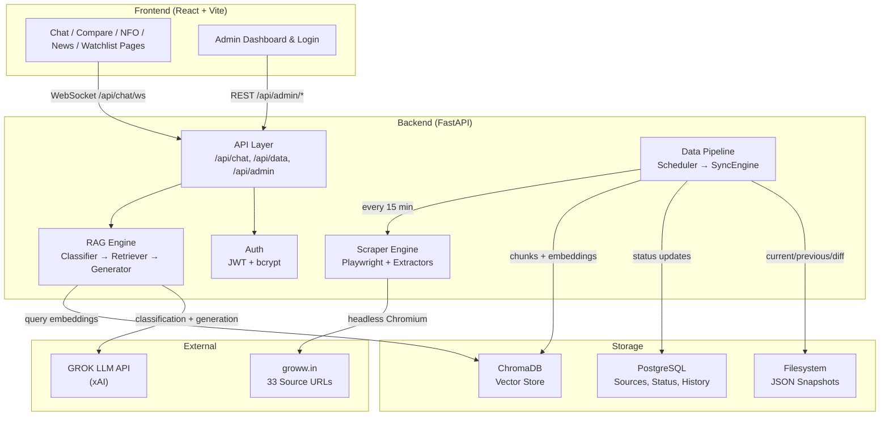
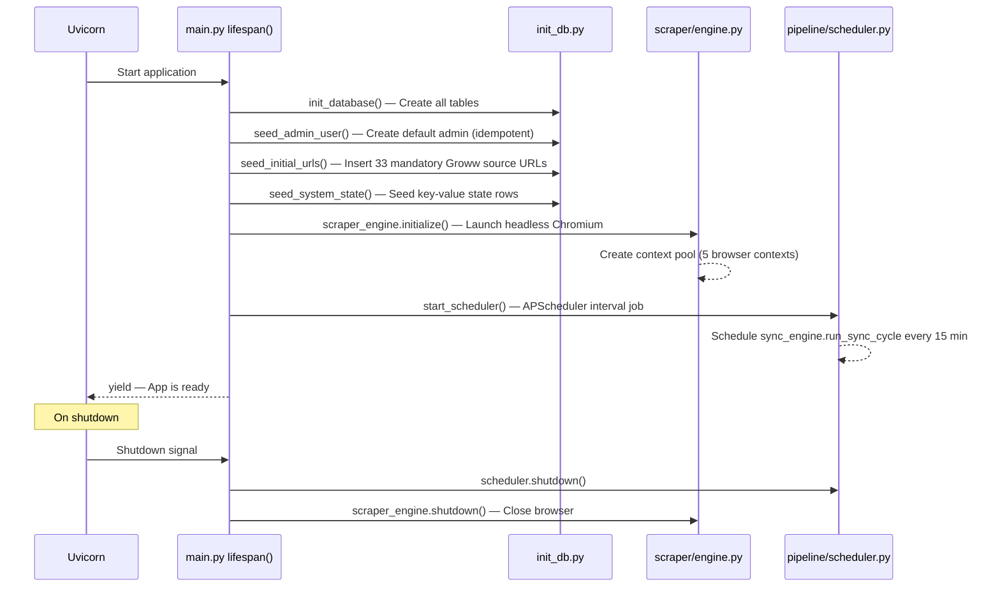
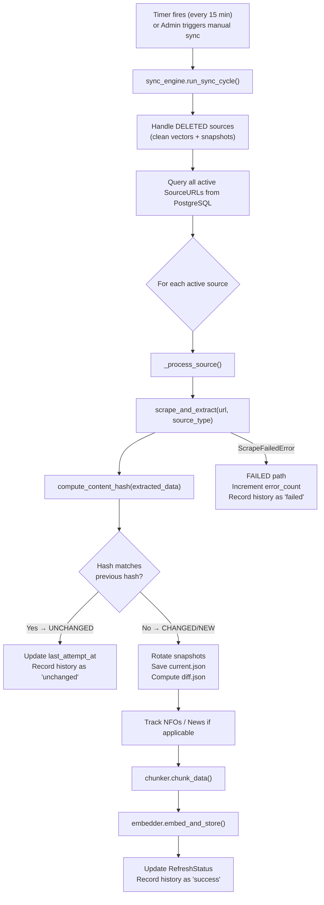
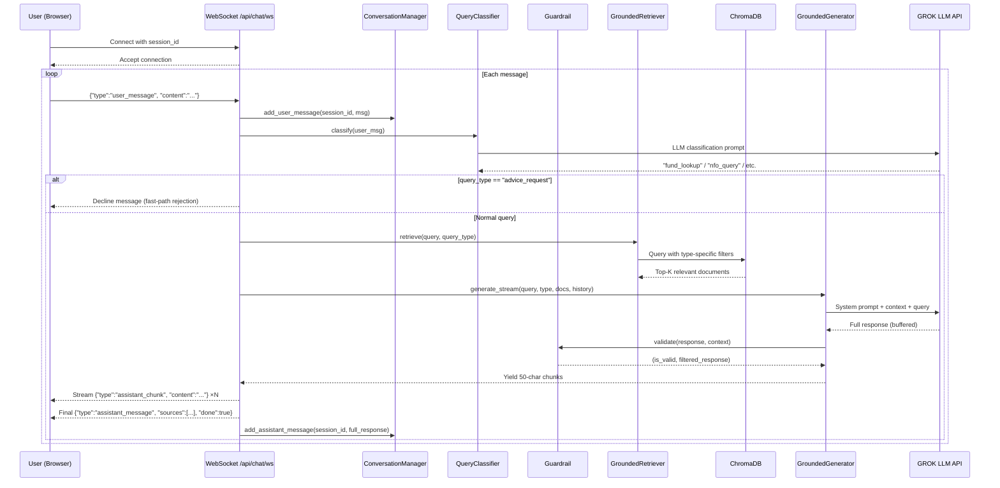
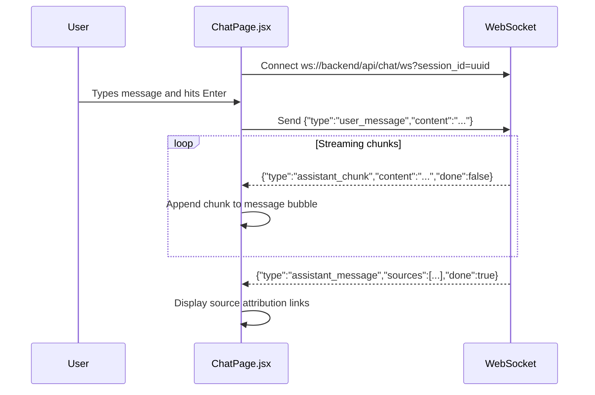
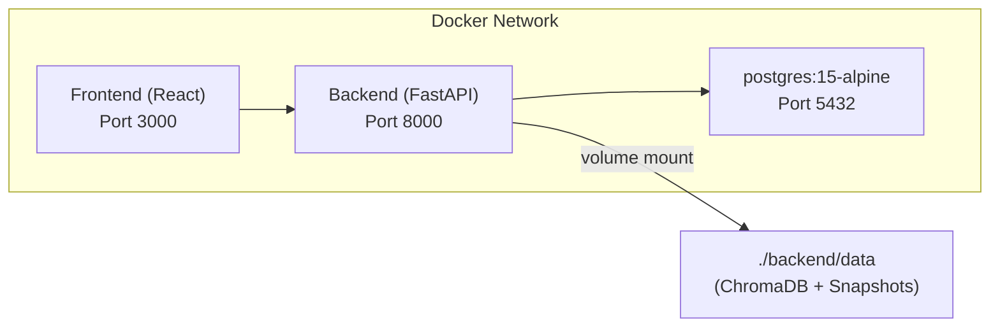

# Groww Market Intelligence RAG — Workflow

This document traces every significant flow in the system end-to-end, from application startup through data ingestion to answering a user query. Each section walks through the exact sequence of operations, the files involved, and how they connect.

---

## Table of Contents

1. [High-Level Architecture](#1-high-level-architecture)
2. [Application Startup Flow](#2-application-startup-flow)
3. [Data Ingestion Pipeline](#3-data-ingestion-pipeline)
   - 3.1 [Scheduled Sync Cycle](#31-scheduled-sync-cycle)
   - 3.2 [Scraping & Extraction](#32-scraping--extraction)
   - 3.3 [Change Detection & Snapshots](#33-change-detection--snapshots)
   - 3.4 [Chunking](#34-chunking)
   - 3.5 [Embedding & Vector Storage](#35-embedding--vector-storage)
4. [User Chat Query Flow (RAG Pipeline)](#4-user-chat-query-flow-rag-pipeline)
   - 4.1 [WebSocket Connection](#41-websocket-connection)
   - 4.2 [Query Classification](#42-query-classification)
   - 4.3 [Retrieval](#43-retrieval)
   - 4.4 [Generation & Guardrails](#44-generation--guardrails)
   - 4.5 [Streaming Response](#45-streaming-response)
5. [Admin & Management Flows](#5-admin--management-flows)
6. [Frontend Page Flows](#6-frontend-page-flows)
7. [Deployment Topology](#7-deployment-topology)

---

## 1. High-Level Architecture



> **Key Insight**: Data flows in two independent loops — the **Ingestion Loop** (Scheduler → Scrape → Chunk → Embed) runs on a timer, while the **Query Loop** (User → Classify → Retrieve → Generate) runs on demand via WebSocket.

---

## 2. Application Startup Flow

When the backend starts (via `uvicorn app.main:app`), the [lifespan](file:///d:/GenAI/Practice/Pranju/RAG_for_GROW/backend/app/main.py#L38-L72) context manager executes the following sequence:



### Files Involved

| Step | File | Function |
|------|------|----------|
| Table creation | [init_db.py](file:///d:/GenAI/Practice/Pranju/RAG_for_GROW/backend/app/db/init_db.py) | `init_database()` |
| Admin seeding | [init_db.py](file:///d:/GenAI/Practice/Pranju/RAG_for_GROW/backend/app/db/init_db.py) | `seed_admin_user()` |
| URL seeding | [init_db.py](file:///d:/GenAI/Practice/Pranju/RAG_for_GROW/backend/app/db/init_db.py) | `seed_initial_urls()` |
| Browser launch | [engine.py](file:///d:/GenAI/Practice/Pranju/RAG_for_GROW/backend/app/scraper/engine.py) | `ResilientScraper.initialize()` |
| Scheduler start | [scheduler.py](file:///d:/GenAI/Practice/Pranju/RAG_for_GROW/backend/app/pipeline/scheduler.py) | `start_scheduler()` |
| Configuration | [config.py](file:///d:/GenAI/Practice/Pranju/RAG_for_GROW/backend/app/config.py) | `Settings` (Pydantic) |

---

## 3. Data Ingestion Pipeline

### 3.1 Scheduled Sync Cycle

The [APScheduler](file:///d:/GenAI/Practice/Pranju/RAG_for_GROW/backend/app/pipeline/scheduler.py) fires `sync_engine.run_sync_cycle()` every **15 minutes** (configurable via `SCRAPE_INTERVAL_MINUTES`). An admin can also trigger it manually via the REST endpoint, which calls `trigger_manual_sync()`.



The sync engine implements a **5-state decision matrix** for each source URL:

| State | Condition | Action |
|-------|-----------|--------|
| **NEW** | No previous hash exists | Scrape → Chunk → Embed → Store |
| **CHANGED** | Hash differs from stored hash | Delete old vectors → Scrape → Chunk → Embed → Store |
| **UNCHANGED** | Hash matches stored hash | Skip chunking/embedding, update timestamp |
| **FAILED** | Scrape threw `ScrapeFailedError` | Increment error counter, log error |
| **DELETED** | `is_active == False` | Delete vectors + snapshots |

**File**: [sync_engine.py](file:///d:/GenAI/Practice/Pranju/RAG_for_GROW/backend/app/pipeline/sync_engine.py)

---

### 3.2 Scraping & Extraction

The [scraper router](file:///d:/GenAI/Practice/Pranju/RAG_for_GROW/backend/app/scraper/router.py) orchestrates a two-step process:

1. **Fetch rendered HTML** — The [ResilientScraper](file:///d:/GenAI/Practice/Pranju/RAG_for_GROW/backend/app/scraper/engine.py) uses Playwright headless Chromium with:
   - A pool of **5 reusable browser contexts** (configurable via `SCRAPE_MAX_CONCURRENT`)
   - Resource blocking (images, fonts, stylesheets) for speed
   - **2 retries** with exponential backoff on failure
   - Anti-detection headers (`user-agent`, `disable-blink-features`)

2. **Extract structured data** — The HTML is routed to a type-specific extractor:

| Source Type | Extractor File | Output |
|-------------|---------------|--------|
| `mutual_fund` | [mutual_fund.py](file:///d:/GenAI/Practice/Pranju/RAG_for_GROW/backend/app/scraper/extractors/mutual_fund.py) | Fund name, NAV, returns, ratios, etc. |
| `amc` | [amc.py](file:///d:/GenAI/Practice/Pranju/RAG_for_GROW/backend/app/scraper/extractors/amc.py) | AMC metadata and fund list |
| `nfo` | [nfo.py](file:///d:/GenAI/Practice/Pranju/RAG_for_GROW/backend/app/scraper/extractors/nfo.py) | NFO details (dates, min investment) |
| `market_news` | [market_news.py](file:///d:/GenAI/Practice/Pranju/RAG_for_GROW/backend/app/scraper/extractors/market_news.py) | Article list with titles and content |
| `filter` | [filter_page.py](file:///d:/GenAI/Practice/Pranju/RAG_for_GROW/backend/app/scraper/extractors/filter_page.py) | Filter/category page data |

Each extractor uses **BeautifulSoup** to parse the rendered HTML and returns a structured Python dictionary.

---

### 3.3 Change Detection & Snapshots

Two modules work together to avoid unnecessary re-processing:

**Change Detector** — [change_detector.py](file:///d:/GenAI/Practice/Pranju/RAG_for_GROW/backend/app/pipeline/change_detector.py)
- Computes a deterministic **SHA-256 hash** of the extracted data dictionary
- Uses `json.dumps(data, sort_keys=True)` to ensure identical data always produces the same hash
- The hash is compared against the stored `content_hash` in the `RefreshStatus` table

**Snapshot Manager** — [snapshot_manager.py](file:///d:/GenAI/Practice/Pranju/RAG_for_GROW/backend/app/pipeline/snapshot_manager.py)
- Maintains a filesystem-based snapshot store at `./data/snapshots/<source_url_id>/`
- Three files per source:
  - `current.json` — latest scraped data
  - `previous.json` — data from the prior scrape (rotated on change)
  - `diff.json` — computed diff showing `added`, `removed`, and `changed` keys

```
data/snapshots/
├── 1/
│   ├── current.json
│   ├── previous.json
│   └── diff.json
├── 2/
│   ├── current.json
│   └── ...
└── ...
```

---

### 3.4 Chunking

The [Chunker](file:///d:/GenAI/Practice/Pranju/RAG_for_GROW/backend/app/pipeline/chunker.py) converts extracted JSON data into text chunks suitable for embedding. The strategy varies by source type:

| Source Type | Strategy | Details |
|-------------|----------|---------|
| `mutual_fund` | **Single-Document Textification** | Entire fund data → one chunk with key-value pairs |
| `amc` | **Recursive Text Splitting** | JSON serialized → split at 3200 chars / 400 overlap |
| `nfo` | **Per-Item Chunking** | Each NFO becomes its own chunk |
| `market_news` | **Per-Article Chunking** | Each article becomes its own chunk |
| `filter` | **Recursive Text Splitting** | Same as AMC — generic split |

Each chunk is returned with **metadata** (fund name, category, AMC, etc.) that is stored alongside the vector in ChromaDB for filtered retrieval.

---

### 3.5 Embedding & Vector Storage

The [Embedder](file:///d:/GenAI/Practice/Pranju/RAG_for_GROW/backend/app/pipeline/embedder.py) handles the final step:

1. **Encode** text chunks using `sentence-transformers/all-MiniLM-L6-v2` (384-dim vectors)
2. **Store** in a single ChromaDB collection (`groww_funds`) with cosine similarity
3. Each vector is tagged with metadata: `source_url_id`, `source_type`, plus type-specific fields
4. Vector IDs follow the pattern: `{source_url_id}-{chunk_index}`

On an **update** (CHANGED state), old vectors for that `source_url_id` are deleted first via `delete_by_source()` before re-inserting.

---

## 4. User Chat Query Flow (RAG Pipeline)

This is the core RAG flow — from the user typing a question to receiving a grounded answer.



### 4.1 WebSocket Connection

- **Endpoint**: `ws://localhost:8000/api/chat/ws?session_id=<uuid>`
- **File**: [chat.py](file:///d:/GenAI/Practice/Pranju/RAG_for_GROW/backend/app/api/chat.py)
- The connection stays open for the duration of the user's session
- Messages are JSON objects: `{"type": "user_message", "content": "..."}`

### 4.2 Query Classification

The [QueryClassifier](file:///d:/GenAI/Practice/Pranju/RAG_for_GROW/backend/app/rag/query_classifier.py) sends the user's message to GROK LLM with `temperature=0.0` and asks it to classify into exactly one of **10 query types**:

| Query Type | Example |
|-----------|---------|
| `fund_lookup` | "What is the NAV of HDFC Mid Cap Fund?" |
| `fund_comparison` | "Compare HDFC Small Cap and Nippon India Small Cap" |
| `nfo_query` | "What new NFOs are available?" |
| `news_query` | "What are the latest market news?" |
| `category_search` | "Which funds are in the pharma category?" |
| `metric_search` | "Which fund has the lowest expense ratio?" |
| `freshness_query` | "When was this data last updated?" |
| `change_query` | "What changed since last refresh?" |
| `advice_request` | "Should I buy HDFC Mid Cap Fund?" |
| `general` | Anything else |

> **Fast-path**: If the query is classified as `advice_request`, the system immediately declines without hitting the retriever or generator.

### 4.3 Retrieval

The [GroundedRetriever](file:///d:/GenAI/Practice/Pranju/RAG_for_GROW/backend/app/rag/retriever.py) queries ChromaDB with strategy tuned to the query type:

| Query Type | ChromaDB Filter | Top-K |
|-----------|----------------|-------|
| `fund_lookup` | `source_type = "mutual_fund"` | 5 |
| `fund_comparison` | `source_type = "mutual_fund"` | 10 |
| `nfo_query` | `source_type = "nfo"` | 10 |
| `news_query` | `source_type = "market_news"` | 10 |
| `category_search` | `source_type = "mutual_fund"` | 15 |
| `metric_search` | `source_type = "mutual_fund"` | 20 |
| `freshness_query` | *(handled via DB, not ChromaDB)* | — |
| `change_query` | *(handled via snapshots, not ChromaDB)* | — |

The retriever encodes the query using the **same embedding model** used during ingestion to ensure vector compatibility.

### 4.4 Generation & Guardrails

**Generator** — [generator.py](file:///d:/GenAI/Practice/Pranju/RAG_for_GROW/backend/app/rag/generator.py)
1. Formats retrieved documents into a numbered context block
2. Builds the system prompt using [prompt_templates.py](file:///d:/GenAI/Practice/Pranju/RAG_for_GROW/backend/app/rag/prompt_templates.py) with query-type-specific instructions
3. Calls GROK LLM with `temperature=0.2` and `stream=False` (buffered for guardrailing)
4. Passes the full response through the guardrail before yielding

**System Prompt Rules** (enforced in every call):
- STRICT GROUNDING: Answer only from provided context
- If data is not in context → reply "Currently I dont have the data to answer the query"
- NEVER provide investment advice
- Comparisons: side-by-side facts only, no subjective rankings
- Show "N/A" for missing fields

**Guardrail** — [guardrail.py](file:///d:/GenAI/Practice/Pranju/RAG_for_GROW/backend/app/rag/guardrail.py)
- Scans the LLM response against **12 regex patterns** for investment advice ("you should", "I recommend", "buy now", etc.)
- If any pattern matches → replaces the entire response with a decline message
- Acts as a safety net in case the LLM ignores its system prompt

### 4.5 Streaming Response

The generator yields the guardrailed response in **50-character chunks** to the WebSocket. The client receives:
1. Multiple `{"type": "assistant_chunk", "content": "...", "done": false}` messages
2. One final `{"type": "assistant_message", "sources": [...], "done": true}` with source attribution

**Conversation Memory** — [conversation.py](file:///d:/GenAI/Practice/Pranju/RAG_for_GROW/backend/app/rag/conversation.py)
- Keeps the last **10 exchanges** (20 messages) per session in memory
- History is formatted as `User: ... / Assistant: ...` and injected into the system prompt

---

## 5. Admin & Management Flows

### Authentication

- **Login**: `POST /api/admin/login` → validates credentials → returns JWT
- **Token validation**: All admin endpoints require `Authorization: Bearer <token>`
- **Implementation**: [jwt_handler.py](file:///d:/GenAI/Practice/Pranju/RAG_for_GROW/backend/app/auth/jwt_handler.py) + [password.py](file:///d:/GenAI/Practice/Pranju/RAG_for_GROW/backend/app/auth/password.py)
- Default credentials: `admin / admin` (seeded on startup)

### Admin API Endpoints

| Endpoint | Action |
|----------|--------|
| `POST /api/admin/login` | Authenticate and get JWT |
| `GET /api/admin/urls` | List all source URLs with status |
| `POST /api/admin/urls` | Add a new source URL |
| `DELETE /api/admin/urls/{id}` | Deactivate a source URL |
| `POST /api/admin/sync` | Trigger a manual sync cycle |
| `GET /api/admin/status` | Get system-wide sync status |

**File**: [admin.py](file:///d:/GenAI/Practice/Pranju/RAG_for_GROW/backend/app/api/admin.py)

### Data API Endpoints

| Endpoint | Action |
|----------|--------|
| `GET /api/data/nfos` | Fetch tracked NFOs |
| `GET /api/data/news` | Fetch tracked news articles |
| `GET /api/data/funds` | Fetch fund data |
| `GET /api/data/snapshots/{id}` | Fetch snapshot + diff for a source |

**File**: [data.py](file:///d:/GenAI/Practice/Pranju/RAG_for_GROW/backend/app/api/data.py)

---

## 6. Frontend Page Flows

The React frontend ([App.jsx](file:///d:/GenAI/Practice/Pranju/RAG_for_GROW/frontend/src/App.jsx)) uses React Router with the following pages wrapped in a shared [AppLayout](file:///d:/GenAI/Practice/Pranju/RAG_for_GROW/frontend/src/components/layout):

| Route | Page Component | Description |
|-------|---------------|-------------|
| `/` | [ChatPage](file:///d:/GenAI/Practice/Pranju/RAG_for_GROW/frontend/src/pages/ChatPage.jsx) | WebSocket-based chat interface with streaming responses |
| `/compare` | [ComparePage](file:///d:/GenAI/Practice/Pranju/RAG_for_GROW/frontend/src/pages/ComparePage.jsx) | Side-by-side fund comparison tables |
| `/nfo` | [NFOPage](file:///d:/GenAI/Practice/Pranju/RAG_for_GROW/frontend/src/pages/NFOPage.jsx) | List of new fund offerings |
| `/news` | [NewsPage](file:///d:/GenAI/Practice/Pranju/RAG_for_GROW/frontend/src/pages/NewsPage.jsx) | Market news feed from Groww |
| `/watchlist` | [WatchlistPage](file:///d:/GenAI/Practice/Pranju/RAG_for_GROW/frontend/src/pages/WatchlistPage.jsx) | User's tracked funds |
| `/admin/login` | [AdminLogin](file:///d:/GenAI/Practice/Pranju/RAG_for_GROW/frontend/src/pages/admin/AdminLogin.jsx) | Admin authentication form |
| `/admin/dashboard` | [AdminDashboard](file:///d:/GenAI/Practice/Pranju/RAG_for_GROW/frontend/src/pages/admin/AdminDashboard.jsx) | URL management, sync control, status monitoring |

### Chat Page Flow



The frontend also uses a [useNotifications](file:///d:/GenAI/Practice/Pranju/RAG_for_GROW/frontend/src/hooks/useNotifications.js) hook for NFO and news alerts.

---

## 7. Deployment Topology

The project supports two deployment modes:

### Docker Compose (Local / Staging)

Defined in [docker-compose.yml](file:///d:/GenAI/Practice/Pranju/RAG_for_GROW/docker-compose.yml):



- **PostgreSQL** starts first with a health check
- **Backend** waits for `service_healthy` on Postgres before starting
- **Frontend** depends on the backend being up
- Data is persisted via Docker volume (`postgres_data`) and bind mount (`./backend/data`)

### Production

- Backend: Railway ([railway.toml](file:///d:/GenAI/Practice/Pranju/RAG_for_GROW/railway.toml))
- Frontend: Vercel ([vercel.json](file:///d:/GenAI/Practice/Pranju/RAG_for_GROW/frontend/vercel.json))
- Database: Managed PostgreSQL (Railway or similar)

---

## Summary: End-to-End Data Journey

```
groww.in page
    ↓ Playwright renders JavaScript
Rendered HTML
    ↓ BeautifulSoup extracts structured data
Python Dict (e.g., {fund_name, nav, returns, ...})
    ↓ SHA-256 hash → change detection
    ↓ JSON snapshot saved to disk
    ↓ Type-specific chunking (single-doc / per-item / recursive split)
Text Chunks + Metadata
    ↓ sentence-transformers encodes to 384-dim vectors
ChromaDB Vector Store
    ↓ User asks a question
    ↓ GROK classifies the query type
    ↓ Retriever fetches top-K relevant chunks with type filter
    ↓ Context + system prompt → GROK generates grounded answer
    ↓ Guardrail scans for advice patterns
    ↓ 50-char chunks streamed via WebSocket
User sees the answer with source attribution
```
